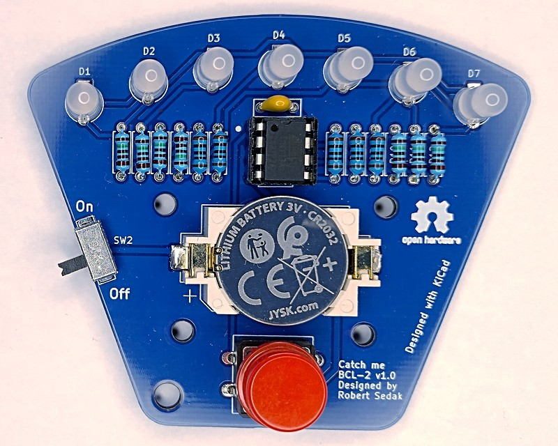
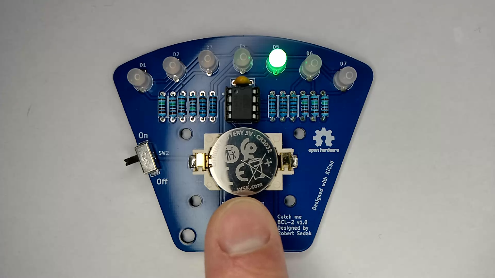
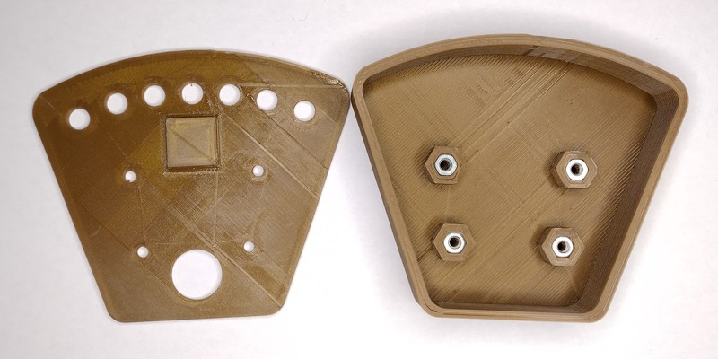
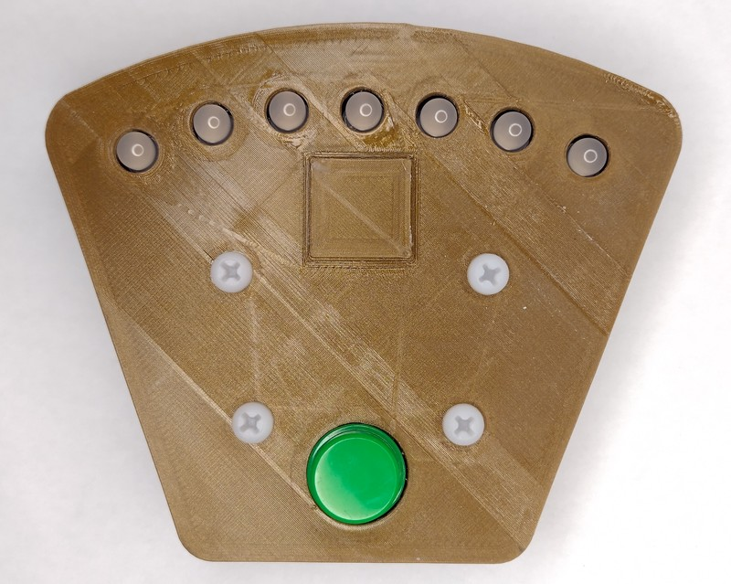

[Croatian version](README_HR-HR.md).

Introduction
============
My friend Zvonimir Lapov asked me if I could design THT PCB which would be used in primary school student education.
Purpose of 'Catch me BCL-2' module is student education. It shows advantages of charlieplexing with seven BI-color LEDs.
This version is designed for the case when the BI-color LED has a brighter LED on pin 3.
There are many variations of bi-color LEDs on the market, so you will need to define the resistors yourself.

Photo by Robert Sedak

Warning:
------------
In order for the program to be fully executed, the RESET pin on the ATtiny must be declared as an input/output pin. This is achieved by activating the FUSE bit called RSTDISBL. If we want to reprogram the ATtiny afterwards, we must turn off the FUSE bit called RSTDISBL using the high-voltage (12V) programming technique.
The procedure for programming the FUSE bits and the high-voltage programming technique can be found in professional literature. Use your newly acquired knowledge only when you fully understand what you have to do. Otherwise, you may damage the microcontroller.

Contributor
------------
- Robert Sedak — features, programming, schematic design, CAD design, case for PCB
- Zvonimir Lapov - idea

Application
-----------
Robert Sedak made a video with example programmed in Arduino IDE with ATtiny85 support:

Photo by Robert Sedak

You can download example for Arduino IDE from [here](examples/).

Bill Of Materials
-----------------
- 1 ea., PCB
- 5 ea., 100 ohm 1/4W 1% Resistor (R1, R2, R3, R4, R5)
- 7 ea., 1.5K ohm 1/4W 1% Resistor (R6, R7, R8, R9, R10, R11, R12)
- 7 ea., BI-color LED 5mm (D1, D2, D3, D4, D5, D6, D7) with common cathode
- 4 ea., 6x6x4.3mm SPST Momentary push switch (SW1)
- 1 ea., SDPT 1P2T slide switch (SW2)
- 1 ea., 100nF 50V Monolithic Ceramic Capacitor
- 1 ea., 8-Pin DIL IC Socket
- 1 ea., ATtiny85 or ATtiny13A
- 1 ea., battery holder Keystone 1060
- 1 ea., battery 2032

Design Files
------------
This project is designed using Open Source [KiCad](http://kicad.org/). Design files are located in the [design_files](design_files/) folder.  You can see the [schematic](images/attiny85_catch_me_bcl-2_schematic.pdf).

Gerber files
------------
You can download gerber files from [here](gerber/attiny85_catch_me_bcl-2.zip).

Firmware
--------
This project can be programmed using the Open Source [Arduino](https://www.arduino.cc/).
[ATTinyCore by Spence Konde](https://github.com/SpenceKonde/ATTinyCore) was used to program ATtiny85 in Arduino IDE
[MicroCore by MCUdude](https://github.com/MCUdude/MicroCore) was used to program ATtiny13 in Arduino IDE.
Arduino examples for Arduino IDE are located in [examples](examples/) folder.

Case
-------
Robert Sedak created case for PCB. You can download STL and FCStd file from [case](case/) folder.
This case was designed using Open Spource [FreeCAD](https://www.freecad.org/).

**Bill Of Connecting Materials**
- 4 ea., M3 nuts
- 4 ea., M3x5mm + 4mm  Male to Female plastic Hex Spacer
- 4 ea., M3x5mm plastic screw

Photo by Robert Sedak

Photo by Robert Sedak

License
-------
[Attribution-ShareAlike 4.0 International (CC BY-SA 4.0)](https://creativecommons.org/licenses/by-sa/4.0/)

You are free to:
- Share — copy and redistribute the material in any medium or format
- Adapt — remix, transform, and build upon the material

This license is acceptable for Free Cultural Works.
- The licensor cannot revoke these freedoms as long as you follow the license terms.

Under the following terms:
- Attribution — You must give appropriate credit, provide a link to the license, and indicate if changes were made. You may do so in any reasonable manner, but not in any way that suggests the licensor endorses you or your use.
- ShareAlike — If you remix, transform, or build upon the material, you must distribute your contributions under the same license as the original.

No additional restrictions — You may not apply legal terms or technological measures that legally restrict others from doing anything the license permits.

Reference Designs ARE PROVIDED "AS IS" AND "WITH ALL FAULTS". Authors DISCLAIMS ALL OTHER WARRANTIES, EXPRESS OR IMPLIED, REGARDING PRODUCTS, INCLUDING BUT NOT LIMITED TO, ANY IMPLIED WARRANTIES OF MERCHANTABILITY OR FITNESS FOR A PARTICULAR PURPOSE.
Authors may make changes to specifications and product descriptions at any time, without notice. The Customer must notrely on the absence or characteristics of any features or instructions marked "reserved" or "undefined."
Authors reservesthese for future definition and shall have no responsibility whatsoever for conflicts or incompatibilities arising from future changes to them. The product information on the Web Site or Materials is subject to change without notice. Do not finalize a design with this info.

